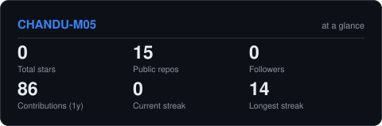
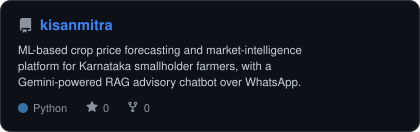
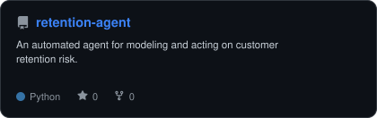
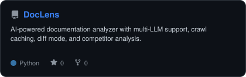
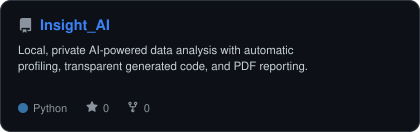

<div align="center">

<!-- PORTRAIT - generated by scripts/dotify.py. Colour mode, one file for both themes.
     Regenerate with:
       python scripts/dotify.py me.png -o assets/portrait --cols 100 --equalize --detail 0.5 --color -->


<br>

<!-- NAME / TAGLINE - animated typing -->
<a href="https://github.com/CHANDU-M05">
  
</a>

<br>

<!-- SOCIALS -->
<a href="https://www.linkedin.com/in/chandu-m-001127291"></a>


</div>

---

## `~/` whoami

```console
$ cat about.txt
```

Hi, I'm **Chandu M**. Final-year CSE student building AI/ML and backend systems that
solve real problems, not just tutorial ones.

- Currently building **[KisanMitra](https://github.com/CHANDU-M05/kisanmitra)** — an ML-based agri price forecasting and advisory platform for Karnataka smallholder farmers
- Learning **enterprise IT support (L1/L2)** alongside my ML work
- Also **Secretary Operations at Rotaract Club, Atria Institute of Technology**
- Fun fact: **I've had my headline result nearly break because of a temporal leakage bug — now I re-check every benchmark with `TimeSeriesSplit`**

<br>

<div align="center">

## `~/` toolbox


</div>

---

<div align="center">

## `~/` skill radar

<table>
<tr>
<td width="50%" align="center" valign="middle">

<!-- Self-rated radar - edit assets/skills.json, the workflow redraws it -->
<picture>
  <source media="(prefers-color-scheme: dark)"  srcset="assets/radar-dark.svg">
  <source media="(prefers-color-scheme: light)" srcset="assets/radar-light.svg">
  
</picture>

</td>
<td width="50%" align="center" valign="middle">

<!-- Live radar built from real language byte counts across your repos -->
<picture>
  <source media="(prefers-color-scheme: dark)"  srcset="assets/radar-langs-dark.svg">
  <source media="(prefers-color-scheme: light)" srcset="assets/radar-langs-light.svg">
  
</picture>

</td>
</tr>
</table>

</div>

---

<div align="center">

## `~/` contribution calendar

<!-- 3D isometric calendar, regenerated every 6h by .github/workflows/metrics.yml -->


<br><br>

<!-- Snake eats the contribution graph - .github/workflows/snake.yml -->
<picture>
  <source media="(prefers-color-scheme: dark)"  srcset="https://raw.githubusercontent.com/CHANDU-M05/CHANDU-M05/output/snake-dark.svg">
  <source media="(prefers-color-scheme: light)" srcset="https://raw.githubusercontent.com/CHANDU-M05/CHANDU-M05/output/snake.svg">
  
</picture>

</div>

---

<div align="center">

## `~/` the numbers

<!-- Generated by scripts/cards.py into this repo, so it never 503s on a shared instance. -->
<picture>
  <source media="(prefers-color-scheme: dark)"  srcset="assets/card-stats-dark.svg">
  <source media="(prefers-color-scheme: light)" srcset="assets/card-stats-light.svg">
  
</picture>

<br>


<br><br>


</div>

---

<div align="center">

## `~/` selected work

<!-- Cards generated by scripts/cards.py from assets/projects.json.
     Stars, forks and language are pulled live from the API on every run. -->
<table>
<tr>
<td width="50%">
  <a href="https://github.com/CHANDU-M05/kisanmitra">
    <picture>
      <source media="(prefers-color-scheme: dark)"  srcset="assets/card-kisanmitra-dark.svg">
      <source media="(prefers-color-scheme: light)" srcset="assets/card-kisanmitra-light.svg">
      
    </picture>
  </a>
</td>
<td width="50%">
  <a href="https://github.com/CHANDU-M05/retention-agent">
    <picture>
      <source media="(prefers-color-scheme: dark)"  srcset="assets/card-retention-agent-dark.svg">
      <source media="(prefers-color-scheme: light)" srcset="assets/card-retention-agent-light.svg">
      
    </picture>
  </a>
</td>
</tr>
<tr>
<td width="50%">
  <a href="https://github.com/CHANDU-M05/DocLens">
    <picture>
      <source media="(prefers-color-scheme: dark)"  srcset="assets/card-DocLens-dark.svg">
      <source media="(prefers-color-scheme: light)" srcset="assets/card-DocLens-light.svg">
      
    </picture>
  </a>
</td>
<td width="50%">
  <a href="https://github.com/CHANDU-M05/Insight_AI">
    <picture>
      <source media="(prefers-color-scheme: dark)"  srcset="assets/card-Insight_AI-dark.svg">
      <source media="(prefers-color-scheme: light)" srcset="assets/card-Insight_AI-light.svg">
      
    </picture>
  </a>
</td>
</tr>
</table>

<sub>

| project | stack |
|---|---|
| **[kisanmitra](https://github.com/CHANDU-M05/kisanmitra)** | `React` `FastAPI` `PostgreSQL` `pgvector` `Gemini` |
| **[retention-agent](https://github.com/CHANDU-M05/retention-agent)** | `Python` |
| **[DocLens](https://github.com/CHANDU-M05/DocLens)** | `Python` |
| **[Insight_AI](https://github.com/CHANDU-M05/Insight_AI)** | `Python` |

</sub>

</div>

---

<div align="center">

<sub>`01100011 01101111 01100100 01100101 00100000 01100001 01101110 01100100 00100000 01100011 01110010 01101111 01110000 01110011`</sub>

</div>
